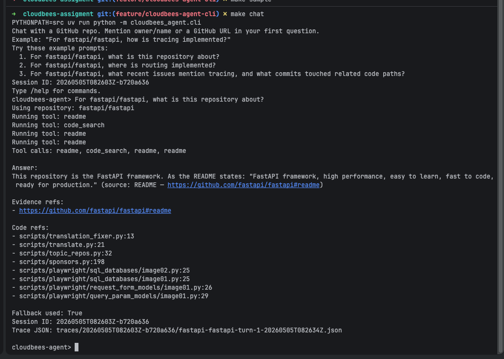

# CloudBees GitHub Evidence Agent

This is a small CLI for repository code research.
Given a public GitHub repository, it runs a long-running chat session, calls read-only evidence tools, and answers from the collected evidence.
The implementation uses Pydantic AI with OpenAI when credentials are present, and offline test models when they are not.

## In This README

- [Demo](#demo)
- [Run Commands](#run-commands)
- [Configuration](#configuration)
- [Chat Commands](#chat-commands)
- [Output Format](#output-format)
- [Agent Behavior](#agent-behavior)
- [Failure Handling](#failure-handling)
- [Evals](#evals)
- [Smoke Checks](#smoke-checks)
- [Assumptions and Limits](#assumptions-and-limits)

## Demo

```bash
cloudbees-agent
For fastapi/fastapi, where is routing implemented?
```



## Run Commands

Start interactive chat:

```bash
make setup
make chat
```

Run one-shot mode:

```bash
make run PROMPT="For fastapi/fastapi, where is routing implemented?"
```

Useful maintenance commands:

```bash
make test
make eval
make smoke
make sample
```

`make sample` writes `sample_run.txt`.
Each turn writes trace JSON under `traces/`.

## Configuration

Set these environment values as needed.
Values are parsed once through the Pydantic settings loader.

- `OPENAI_API_KEY`: enables the live Pydantic AI agent.
- `OPENAI_MODEL`: optional, defaults to `openai:gpt-5-mini`.
- `LOGFIRE_TOKEN`: optional, sends spans to hosted Logfire when present.
- `TRACE_BACKEND`: optional, controls trace persistence:
  - `both` (default): write local trace JSON and emit remote Logfire trace event when `LOGFIRE_TOKEN` is set.
  - `local`: write local trace JSON only.
  - `remote`: emit remote Logfire trace event only when `LOGFIRE_TOKEN` is set.
- `LOGFIRE_CONSOLE`: optional, defaults to `false` so chat mode stays quiet.
- `GITHUB_TOKEN`: optional, reduces GitHub API rate-limit risk.
- `CLONE_ROOT`: optional base directory, defaults to `tmp/repos`.
- `SANDBOX_ROOT`: optional base directory for session sandboxes, defaults to `tmp/sandbox/sessions`.
- `PROMPT_CONFIG`: optional, defaults to `prompts/agent.yaml`.

## Chat Commands

The CLI has two modes.

- `cloudbees-agent` starts a chat loop.
- `cloudbees-agent "For owner/name, ..."` runs one turn.

In chat mode, use:

- `/help` to show available commands.
- `/clear` to reset in-memory conversation history for the current CLI session.
- `/exit` to leave the chat.
- `/quit` to leave the chat.

The first message must include a repository as `owner/name` or a GitHub URL.
If a later message references a different repository, the session switches the active repository and keeps the same in-memory conversation.

Unknown slash commands print a short hint and continue the chat.

## Output Format

Each answer prints three key sections.

- `Tool calls`: tool chain used to gather evidence.
- `Evidence refs`: raw evidence links or path references.
- `Code refs`: compact file and line references such as `path:line`.

Example output:

```text
Tool calls: readme, code_search

Answer:
Tracing is documented in the repository README and code.

Evidence refs:
- https://github.com/fastapi/fastapi/blob/HEAD/fastapi/routing.py#L35
- https://github.com/fastapi/fastapi/blob/HEAD/fastapi/applications.py#L6

Code refs:
- fastapi/routing.py:35
- fastapi/applications.py:6

Fallback used: False
Session ID: 20260101T120000Z-abc12345
Trace JSON: traces/session-id/owner-repo-turn-1-20260101T120000Z.json
```

## Agent Behavior

See [docs/architecture.md](docs/architecture.md) for the design walkthrough.
The agent prompt layers live in [prompts/agent.yaml](prompts/agent.yaml).

Evidence tools are read-only:

- README lookup via GitHub API.
- Issues lookup via GitHub API.
- Recent commits lookup via GitHub API.
- Bounded local code search through a shallow clone.

The model writes a focused `query` for each tool call.
The tool backend uses that query directly instead of deriving search text from the full user question.

Code-search clones are cached under `CLONE_ROOT/<owner-repo>`.
Each session searches against its own copy in
`SANDBOX_ROOT/<session-id>/repos/<owner-repo>`.

## Failure Handling

The failure path is weak first evidence.
If the first tool returns nothing and a later tool finds useful evidence, the trace marks the later tool as fallback.
The final answer includes uncertainty when evidence is not strong.

## Evals

The suite is fixture-backed and does not call GitHub or OpenAI.
It covers README, issues, commits, code search, and fallback behavior.

Run:

```bash
make eval
```

## Smoke Checks

Create `.env` from `.env.example` and set real values.

```bash
OPENAI_API_KEY=...
OPENAI_MODEL=openai:gpt-5-mini
GITHUB_TOKEN=...
LOGFIRE_TOKEN=...
TRACE_BACKEND=both
LOGFIRE_CONSOLE=false
CLONE_ROOT=tmp/repos
SANDBOX_ROOT=tmp/sandbox/sessions
PROMPT_CONFIG=prompts/agent.yaml
```

Then run:

```bash
make smoke
```

`make smoke` is not run by default CI.
It loads `.env`, calls real OpenAI and GitHub services, and flushes Logfire spans when `LOGFIRE_TOKEN` is set.

## Assumptions and Limits

Only public GitHub repositories are in scope.
The tool never writes to GitHub.
Code search uses a temporary shallow clone and skips common vendor/build directories.
By default, fresh code-search clones are written under `tmp/repos/<owner-repo>`.
Session sandbox copies are written under `tmp/sandbox/sessions/<session-id>/repos/<owner-repo>`.
The final answer is intentionally compact and evidence-first.
