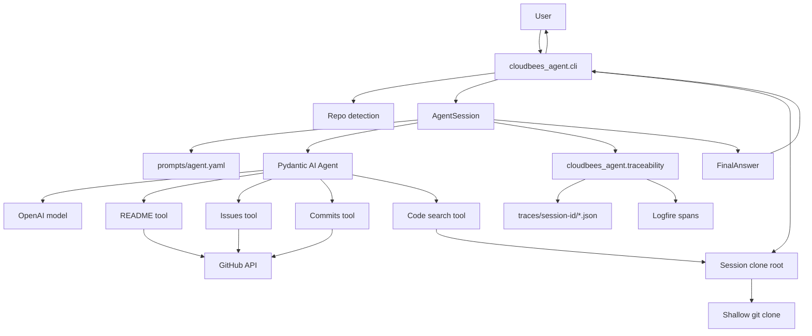

# Architecture

This project is a small conversational CLI agent that answers questions about a public GitHub repository.
The design keeps repo access read-only and lets the Pydantic AI agent choose which evidence tools to call on each turn.

## Entry Point

The CLI lives in `cloudbees_agent.cli`.
It loads `.env`, starts a chat loop when no prompt is provided, and runs one question when a positional prompt is present.
The repository is detected from the user's text as `owner/name` or a GitHub URL.

The Makefile wraps both modes:

```bash
make chat
make run PROMPT="For pydantic/pydantic-ai, ..."
```

## Design Graph



## Agent Session

`AgentSession` owns one repository conversation:

1. Normalize the repository into `owner/name`.
2. Load prompt layers from `prompts/agent.yaml`.
3. Create a Pydantic AI agent with README, issues, commits, and code-search tools.
4. Pass prior `message_history` into each new turn.
5. Record every evidence tool result from the turn.
6. Save updated `message_history` for follow-up questions.
7. Write local trace JSON for the turn.

The live model comes from `OPENAI_MODEL` and defaults to `openai:gpt-5-mini`.
When no OpenAI key is present, the code uses Pydantic AI's `TestModel` so offline tests and basic checks can still exercise tool wiring.

## Prompt YAML

The prompt YAML is the tuneable behavior layer.
`prompts/agent.yaml` is split into `system`, `tool_policy`, and `output_rules`.
Changing prompt text changes model instructions without changing Python tool code.

There is no workflow YAML.
Tool order is chosen by the agent during a turn, and tests use scripted test models when they need fixed tool order.

## Evidence Tools

`GitHubEvidenceTools` exposes four read-only sources:

- `readme`: calls `GET /repos/{owner}/{repo}/readme`, downloads the README text, and extracts relevant lines.
- `issues`: calls `GET /search/issues` scoped to the repository.
- `commits`: calls `GET /repos/{owner}/{repo}/commits?per_page=10` and filters messages by question terms.
- `code_search`: creates a fresh shallow clone and searches bounded source/doc files locally.

The code search path avoids GitHub's code search API so the demo can run with only basic GitHub access.
It skips generated, vendor, test, and build directories to keep results small.
By default, clones are written under `tmp/repos/<session-id>/<owner-repo>`.
Use `CLONE_ROOT` or `--clone-root` to point code search at a different base root.
The CLI appends the session id to that base root so concurrent conversations do not share clone directories.

## Conversation Loop

`cloudbees-agent` starts a REPL.
Each non-command input becomes one agent turn.
The first message must mention a repository.
If a later message mentions a different repository, the CLI switches to that repository and starts a fresh session.

Supported commands:

- `/help`: show commands.
- `/clear`: reset in-memory conversation history.
- `/exit`: leave the loop.
- `/quit`: leave the loop.

Session history is in memory only.
Restarting the CLI starts a new conversation.
Each CLI process has a session id that is printed at startup and stored in trace JSON.

## Tracing

Tracing has two layers:

- Local trace JSON under `traces/`.
- Logfire spans around each agent turn and tool call.

Traceability code lives in `cloudbees_agent.traceability`.
That module owns Logfire setup, span wrappers, session ids, fallback inference, evidence references, trace paths, and trace JSON writes.
`AgentSession` only calls those helpers at the turn and tool boundaries.

Local trace JSON is always written.
Hosted Logfire export only happens when `LOGFIRE_TOKEN` is configured.
Console span output is disabled by default with `LOGFIRE_CONSOLE=false`.
Set `LOGFIRE_CONSOLE=true` when local span output is useful during debugging.

Each trace records session id, repository, question, tool calls, evidence summary, fallback inference, final answer, all evidence results, and conversation turn number.

## Evals and Tests

`make test` runs offline tests only.
It explicitly deselects `smoke` tests so local checks do not call real APIs.

`make eval` runs fixture-backed agent evals.
The eval suite scores first tool selection, fallback behavior, grounded answers, and trace completeness.
It does not call OpenAI or GitHub.

`make smoke` is the manual real-service check.
It loads `.env`, calls OpenAI through Pydantic AI, uses real GitHub evidence tools, writes traces, and calls `logfire.force_flush()`.

## Data Contracts

The core contracts live in `cloudbees_agent.models`.
Pydantic models define evidence results, final answers, eval cases, eval summaries, and local traces.

`EvidenceResult` is one source result, such as README or code search.
`EvidenceItem` is one snippet inside that source.

These models make the CLI output, trace JSON, and eval fixtures explicit enough for review without adding a larger framework around the demo.
